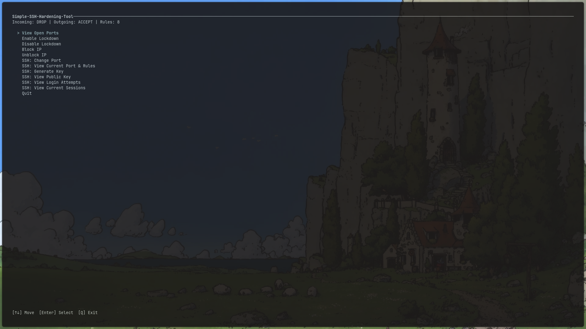

# Simple-SSH-Hardening-Tool
A terminal UI for managing iptables rules and SSH hardening for Linux.


This tool **does not implement a firewall**.  
It **simplifies and manages the existing system firewall (iptables)** and OpenSSH configurations.
---

### This is
- A system security **management** tool
- A TUI wrapper around `iptables`
- An OpenSSH hardening assistant
- A host lockdown orchestrator

---

## Features

### iptables Management
- View (INPUT/OUTPUT policy and rule count)
- List currently listening TCP/UDP ports (`ss`)
- Apply a **lockdown ruleset**:
  - Flushes existing iptables rules
  - Sets INPUT and FORWARD policy to DROP
  - Allows loopback traffic
  - Allows ESTABLISHED,RELATED connections
  - Optionally allows selected TCP ports
  - Allows ICMP (ping)
- Reset iptables policies to ACCEPT
- Block and unblock IP addresses (INPUT chain)

### SSH Hardening
- Detects SSH service name (`ssh` or `sshd`)
- Change SSH port safely:
  - Creates timestamped backups of `sshd_config`
  - Restarts the SSH service
  - Optionally updates iptables rules
- View current SSH port and related iptables rules
- Generate SSH keys (`ed25519` or `rsa`)
- View public SSH keys
- View recent SSH login attempts (journalctl or `/var/log/auth.log`)
- View active SSH sessions on the SSH port

---

## Requirements

### Python
- Python **3**
- No third-party Python libraries required

### System Dependencies

This tool manages system components and requires:

- Linux
- `iptables`
- `iproute2` (for `ss`)
- `openssh-server`
- `sudo`
- `systemd` or SysV init

### Package Installation Examples

**Debian / Ubuntu**
```bash
sudo apt install python3 iptables iproute2 openssh-server 
```
**Arch**
```bash
sudo pacman -S python iptables iproute2 openssh
```
### Installation 

## Clone the repo 
```bash
git clone https://github.com/NT411/Simple-SSH-Hardening-Tool
```
## Open the repo directory 
```bash
cd Simple-SSH-Hardening-Tool
```
## Run the scrypt 
```bash
sudo python sshtui.py
```

### Usage

↑ / ↓ — Navigate menu

Enter — Select action

Q — Quit / return

### Screenshots



